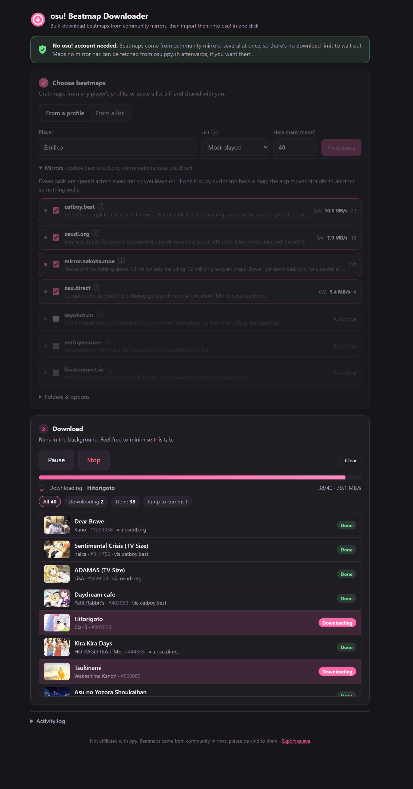
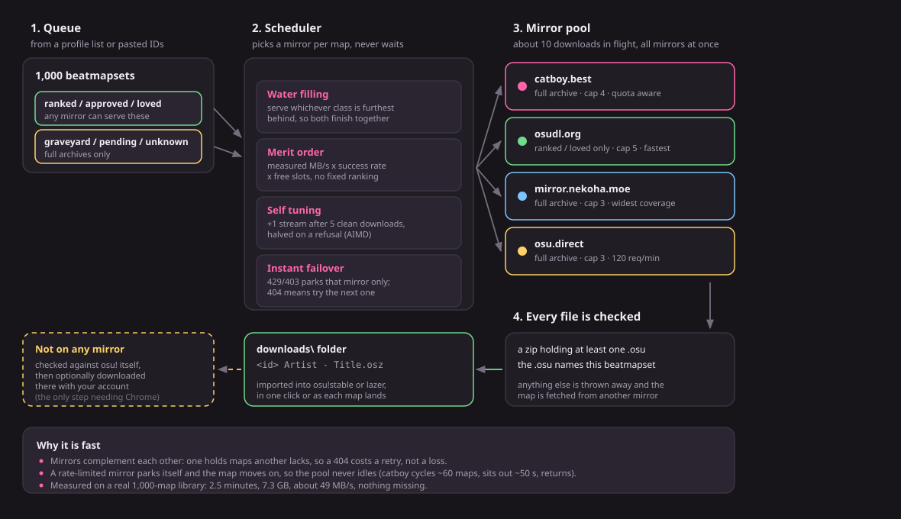
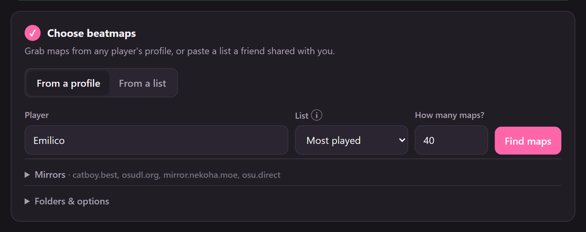
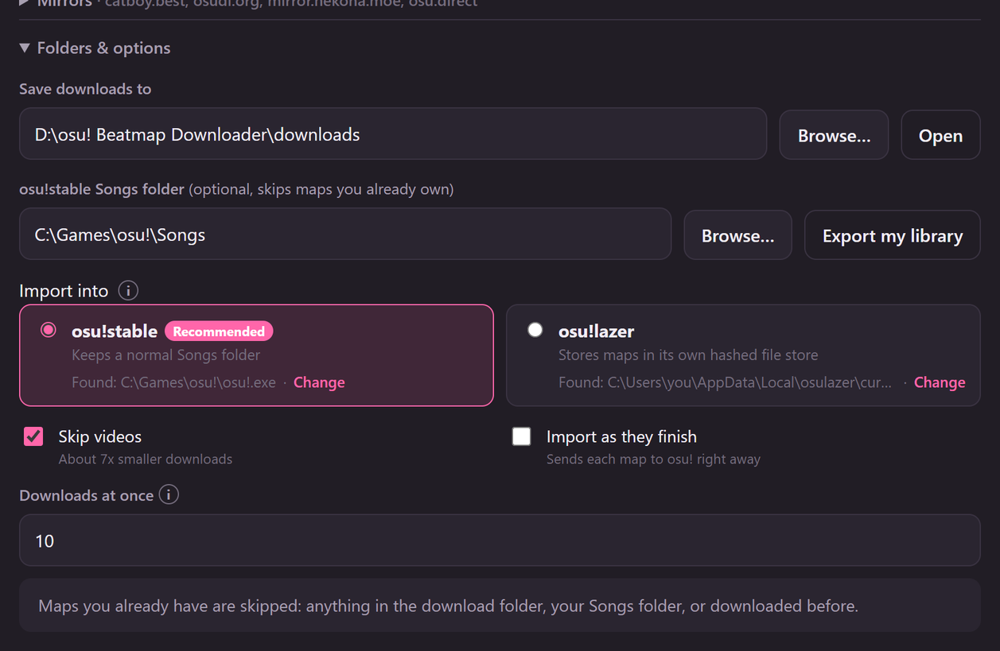
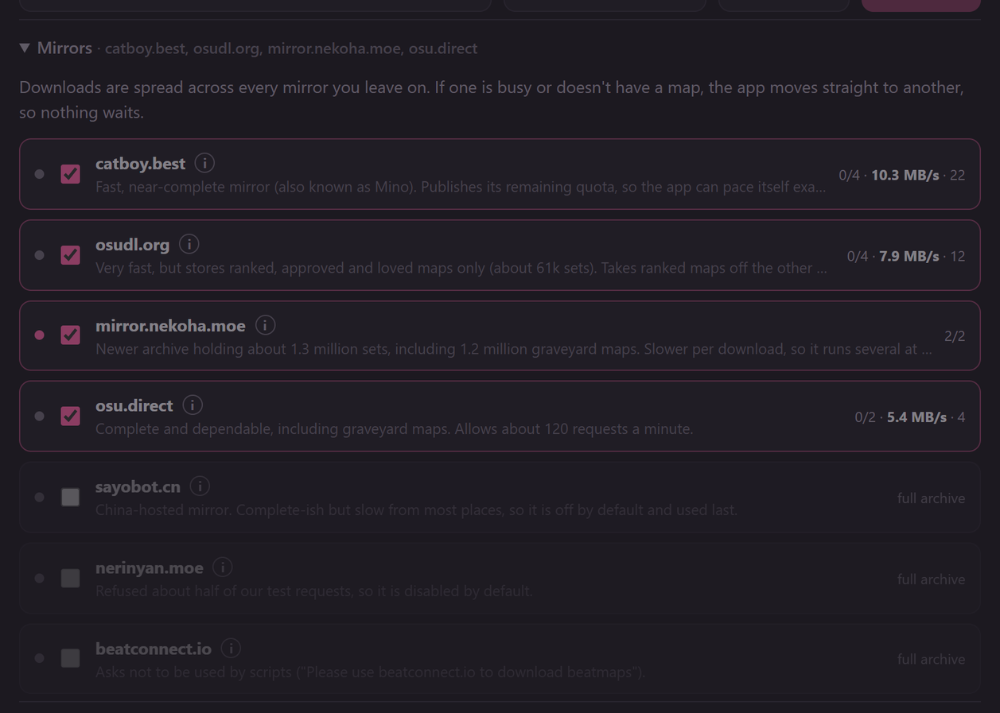
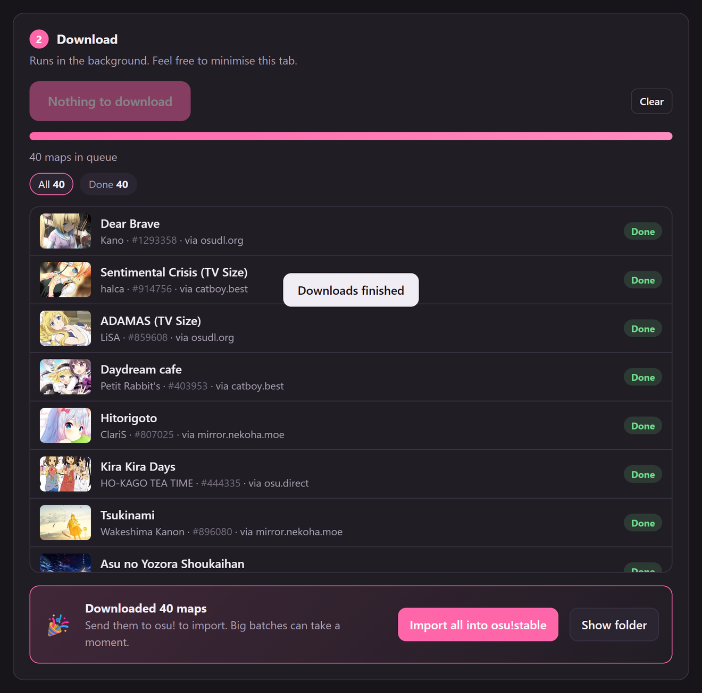
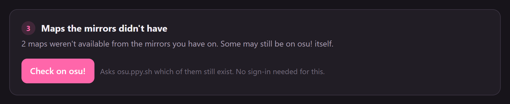
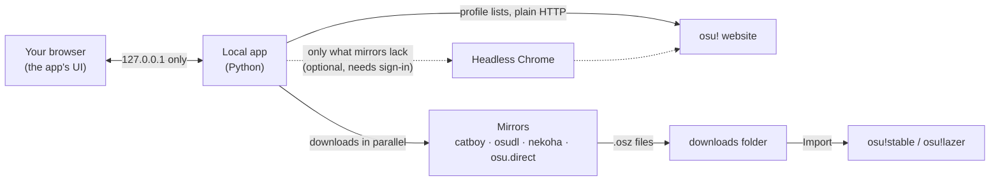

<div align="center">


# osu! Beatmap Downloader

**Bulk-download osu! beatmaps from community mirrors, then import them into osu! in one click.**

Your most played maps, a friend's favourites, or any list of IDs, hundreds at a time,
with a simple app that runs on your own PC.

[](https://github.com/AustinKol/osubeatmapdownloader/releases/latest)

[](LICENSE)

<picture>
  <source media="(prefers-color-scheme: light)" srcset="docs/images/hero-light.png">
  
</picture>

</div>

---

## Motivation

Back in 2020, a hard drive failure wiped out my entire osu! beatmap collection. Luckily, osu! keeps a record of
every beatmap you've played at least once, ranked from most played to least played. I wrote a few scripts to pull
the beatmap list from my profile, and used Selenium and ChromeDriver to download them. I was overjoyed that I got my whole library back!

For years those scripts stayed on my PC. I never got around to building a proper interface or releasing them until now.
With the help of Claude Code, I quickly made a simple HTML interface so that others can enjoy it too,
without needing any coding knowledge.

So far, this is still the best way that I know of to recover lost beatmaps folders. This tool is also a great way to download anyone else's maps, like your favourite pro player's most played list.

> [!NOTE]
> **No osu! account is needed.** Beatmaps come from community mirrors, several at once, so there is no
> hourly download limit to wait out. Maps that no mirror has can be fetched from osu.ppy.sh afterwards,
> if you choose to sign in for that last step.

## Features

- **Grab whole lists at once.** A player's *most played*, *favourites*, *ranked*, *loved*, *guest* or *graveyard* maps. You can also paste IDs/links or open a `.txt` a friend sent you.
- **Fast.** Downloads run from several mirrors at once and the app tunes itself as it goes. A real 1,000-map library took **2.5 minutes** in testing (7.3 GB, about 49 MB/s on a 500 Mbit line), against roughly 5 hours through osu! itself. See [the benchmark](docs/benchmark.md).
- **No account, no browser.** The main flow is plain HTTP. Chrome is only involved if you opt into the final osu! step.
- **Pick your mirrors.** Turn each one on or off, with a note on who runs it and what it covers.
- **Skips what you already have.** Maps in your osu!stable `Songs` folder, in the download folder, or downloaded in an earlier session.
- **One-click import** into **osu!stable** or **osu!lazer**, or automatically as each map finishes.
- **Nothing is lost.** Maps no mirror has are checked against osu! and sorted into "still downloadable" and "gone for good".
- **Portable.** Unzip and run. Settings, downloads and everything else stay inside the app's folder.
- **Share your library.** Export your Songs folder as an ID list your friends can load.

## The mirror load balancer

<div align="center">
<picture>
  <source media="(prefers-color-scheme: light)" srcset="docs/images/scheduler-light.svg">
  
</picture>
</div>

Mirrors are run by volunteers and no two behave alike: they differ in coverage, in speed, in what limits they
publish, and all of that changes minute to minute. Pulling a thousand maps quickly *without* leaning on any one
host is therefore a scheduling problem, and solving it properly is the part of this app I'm most happy with.
The app treats every enabled mirror as one pool and decides, at the instant a slot frees up, who should serve the
next map. It all lives in [`mirrors.py`](mirrors.py), and the numbers below are measured, not guessed
(see [the benchmark](docs/benchmark.md)).

**Two classes of map, filled like water.** Ranked, approved and loved maps can come from any mirror; graveyard,
pending and unknown maps need a full-archive mirror, so the ranked-only mirrors are never even asked for them.
That makes the full archives a scarce resource. When a full-archive slot opens it takes an unknown-status map only
while `unknown_left / full_archive_capacity >= ranked_left / total_capacity`, and otherwise helps with ranked maps.
Both classes then run dry at about the same moment, instead of ending with one mirror grinding through a tail of
graveyard maps alone.

**Mirrors are chosen on merit, not on a hard-coded ranking.** Each mirror carries a score of
`recent MB/s (EWMA) x success rate x free slots`, damped as it approaches a quota it has published, with a little
jitter so ten workers don't stampede the same host. A mirror having a bad minute quietly loses work; when it
recovers, its score climbs back on its own. This is why the priority list doesn't need to be right: the run measures
it for you. In testing, the fastest mirror ended up doing 72% of a 1,000-map list without ever being told to.

**Concurrency tunes itself.** Every mirror starts at 2 parallel downloads, gains one after five clean successes up
to a deliberately modest cap, and halves on a refusal: additive increase, multiplicative decrease, the same feedback
shape TCP uses to find a link's capacity. The pool settles near what each host is actually happy to give, which
during the benchmark drifted between 1 and 5 streams per mirror.

**A refusal costs no time at all.** A `429` (or a `403`, which usually just means too many connections) parks *that
mirror* until the moment named by its `Retry-After` or rate-limit headers, and the map it was carrying is handed to
another mirror in the same breath. Nothing sleeps, nothing retries in place, and the queue never stops moving.
catboy, for example, serves about 60 maps, sits out roughly 50 seconds, and rejoins by itself; the run doesn't
notice. A `404` is information rather than failure: that mirror doesn't have the map, so it's remembered and the map
is tried elsewhere.

**Slow streams are cut, and the finish is raced.** A download under 50 KB/s for 20 seconds is abandoned and
re-dispatched. A map still running after 25 seconds may be raced on a second mirror, with the first complete file
winning and the loser's partial file discarded. Duplicates are impossible because the race is decided on the
beatmapset id, not the filename.

**Nothing counts until it's verified.** A finished file must be a real zip, hold at least one `.osu` difficulty, and
that difficulty's `BeatmapSetID` must match the map we asked for. Anything else is deleted, the mirror takes a short
backoff, the map goes to another mirror, and the activity log gets one line quoting the first ~140 characters of
whatever arrived (nearly always a rate-limit page). The app also checks the drive has room before a run starts,
since 1,000 maps is about 7 GB.

The result, on a real 1,000-map library: **2.5 minutes, 7.3 GB, about 49 MB/s**, no maps missed, no invalid files,
and seven mirror failures that were all recovered elsewhere without me noticing. Through osu! itself, the same list
takes roughly five hours.

## Download

1. Download **`osu-beatmap-downloader-win64.zip`** from the [latest release](https://github.com/AustinKol/osubeatmapdownloader/releases/latest).
2. Unzip it anywhere you like (not *Program Files*), open the folder and double-click **`osu! Beatmap Downloader.exe`**.

Google Chrome is only needed for the optional osu! step at the end.

> [!NOTE]
> The app isn't code-signed, so Windows SmartScreen may say it *protected your PC*.
> Click **More info → Run anyway**. The full source is right here if you'd like to check it, or you can [run it from source](#run-from-source).

A black window opens (that's the app: keep it open while downloading and close it to quit) and your browser shows the interface.

## How to use it

### 1. Choose beatmaps

Type a player name, pick a list and how many maps you want. Or switch to **From a list** and paste IDs or links.

> [!TIP]
> **Recovering a lost library?** Choose **Most played**. It includes every beatmap that player has played at least
> once, so set *How many maps?* high enough to cover the whole collection.



Under **Folders & options** you can choose where maps are saved, point the app at your osu!stable `Songs` folder
so it skips maps you own, pick which osu! to import into, and set how many downloads run at once.



<details>
<summary><b>osu!stable or osu!lazer?</b></summary>

<br>

**osu!stable is recommended.** osu!lazer stores beatmaps as files named by their SHA-256 hash, so there's no
normal `Songs` folder you can browse, back up or share. Importing into stable keeps regular song folders, and
lazer can still use them: in lazer, go to **Settings → Maintenance** and import from your stable install.

The app finds both automatically (wherever they're installed). If it can't, click **Locate…** and pick the folder
that contains `osu!.exe`. If the one you chose isn't installed, it falls back to the other.
</details>

### 2. Download

Hit **Download**. Maps come from every mirror you have enabled, at the same time.



When it's done, click **Import all into osu!** (or tick *Import as they finish* beforehand).



### 3. Maps the mirrors didn't have (optional)

Mirrors are community archives, so a few maps may be missing: very new maps, or ones nobody has copied.
The app collects those and can check them against osu! itself, which needs no account:

- **Still on osu!**: sign in and the app downloads them in a hidden Chrome, respecting osu!'s hourly limit.
- **Gone for good**: deleted or download-disabled, so nowhere has them. You can save the list.



> [!WARNING]
> If you use that last step, your sign-in is saved in the app's `data\` folder, so treat that folder like a
> password: don't share or upload it. **Sign out** (top right) deletes it.

## Mirrors

| Mirror | Run by | Coverage | Notes |
|---|---|---|---|
| [catboy.best](https://catboy.best) | Mino | Full archive | Fast, publishes its remaining quota so the app can pace itself |
| [osudl.org](https://osudl.org) | kaysting | Ranked, approved, loved (~61k sets) | Very fast; takes ranked maps off the other mirrors |
| [mirror.nekoha.moe](https://mirror.nekoha.moe) | Nekoha | Full archive (~1.3M sets) | Slower per download, so it runs several at once |
| [osu.direct](https://osu.direct) | osu.direct | Full archive | Dependable, about 120 requests a minute |
| [sayobot](https://osu.sayobot.cn) | SayoBot | Mostly complete | Off by default: slow from outside Asia |
| nerinyan.moe | NeriNyan | Full archive | Disabled: refused about half of our test requests |
| beatconnect.io | beatconnect | Full archive | Disabled: asks not to be used by scripts |

Please be kind to them: they're volunteers paying for bandwidth. The defaults are deliberately modest, and
[docs/benchmark.md](docs/benchmark.md) records what each mirror covered, how fast it was, and how it handles limits.

How the work is spread between them, and what happens when one of them says no, is described in
[The mirror load balancer](#the-mirror-load-balancer) above.

## Troubleshooting

| Problem | Fix |
|---|---|
| **Some maps say "not on mirrors"** | Use **Check on osu!** in step 3. Mirrors are community archives and don't have everything, especially brand-new maps. |
| **Downloads seem slow** | Turn on more mirrors, raise *Downloads at once*, and leave **Skip videos** on (maps are about 7x smaller without video). Your own connection is usually the limit. |
| **Running out of disk** | Budget about **7 GB per 1,000 maps** without video (median map is 6.5 MB), or roughly 20 GB with video. |
| **A mirror shows "waiting"** | It asked us to slow down. The app keeps going on the others and picks it up again automatically. |
| **"osu!'s hourly download limit reached"** | Only in the optional osu! step: it allows about 200 downloads an hour. The app waits and retries by itself. |
| **"You're signed out of osu!"** | Your saved sign-in expired (after about a month). Sign in again in step 3. |
| **Chrome won't start** | Only the optional osu! step needs Chrome. Make sure it's installed and up to date. |
| **Can't save settings** | The app's folder must be writable, so don't put it in *Program Files*. (It falls back to `%LOCALAPPDATA%\osu! Beatmap Downloader`.) |

## How it works



Everything stays on your machine. The interface is served only on `127.0.0.1`, requests from other websites are
rejected, and nothing is sent anywhere except the mirrors and osu! itself.

### Portable folder layout

```
osu! Beatmap Downloader\
├── osu! Beatmap Downloader.exe
├── README.txt
├── runtime\      the app itself (Python, Selenium, UI)
├── data\         settings, download history, and the saved sign-in if you use the osu! step
└── downloads\    .osz files waiting to be imported
```

Move the folder to move the app; delete it to uninstall.

## Run from source

Requires Python 3.10+. Google Chrome is optional (only the osu! step uses it).

```bash
git clone https://github.com/AustinKol/osubeatmapdownloader.git
cd osubeatmapdownloader
```

On Windows, double-click **`start.bat`**. It creates a virtual environment, installs dependencies and opens the app.
Elsewhere:

```bash
python3 -m venv .venv
.venv/bin/pip install -r requirements.txt
.venv/bin/python app.py
```

Options: `--port 1234` to use another port, `--no-browser` to not open a tab.

### Building a release

Double-click **`build.bat`**. It produces:

- `dist\osu! Beatmap Downloader\`: the portable app folder
- `dist\osu-beatmap-downloader-win64.zip`: that folder zipped, ready to attach to a GitHub release

### Project layout

| Path | What it is |
|---|---|
| [`app.py`](app.py) | Local web server and the actions behind every button |
| [`osu_api.py`](osu_api.py) | osu! profile lists, ID parsing and map lookups, over plain HTTP |
| [`mirrors.py`](mirrors.py) | The mirror registry, the scheduler and the downloader |
| [`osu_local.py`](osu_local.py) | Finding osu!stable/lazer, importing maps, process cleanup |
| [`osu_browser.py`](osu_browser.py) | The optional osu! step: sign-in and downloads via Chrome |
| [`web/index.html`](web/index.html) | The whole interface, in plain HTML, CSS and JavaScript |
| [`build.bat`](build.bat) · [`tools/`](tools) · [`assets/`](assets) | Release packaging (PyInstaller), the app icon, and the script that draws the diagram above |

## Contributing

Issues and pull requests are welcome. Adding a mirror is a few lines in `MIRRORS` at the top of
[`mirrors.py`](mirrors.py): a download URL, whether it carries graveyard maps, and a sensible parallel-download cap.

## Disclaimer

Not affiliated with or endorsed by ppy Pty Ltd. "osu!" is a trademark of ppy Pty Ltd. Beatmaps come from
third-party community mirrors; please be considerate of their bandwidth and don't download more than you'll play.

## License

[MIT](LICENSE)
