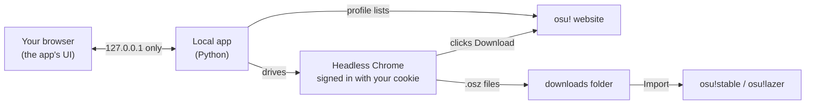

<div align="center">


# osu! Beatmap Downloader

**Bulk-download osu! beatmaps in the background, then import them into osu! in one click.**

Your most played maps, a friend's favourites, or any list of IDs — hundreds at a time,
with a simple app that runs on your own PC.

[](https://github.com/AustinKol/osubeatmapdownloader/releases/latest)

[](LICENSE)

<picture>
  <source media="(prefers-color-scheme: light)" srcset="docs/images/hero-light.png">
  
</picture>

</div>

---

## Motivation

Back in 2020, a hard drive failure wiped out my entire osu! beatmap collection. Luckily, osu! keeps a record of
every beatmap you've played at least once, ranked from most played to least played. I wrote a few scripts to pull
the beatmap list from my profile, and used Selenium and ChromeDriver to download them. I was overjoyed that I got my whole library back!

For years those scripts stayed on my PC. I never got around to building a proper interface or releasing them until now.
Now, with the help of Claude, I quickly made a simple HTML interface so that others can enjoy it too,
without needing any coding knowledge.

This tool is also a great way to download anyone else's maps, like your favourite pro player's most played list.

## Features

- **Grab whole lists at once.** A player's *most played*, *favourites*, *ranked*, *loved*, *guest* or *graveyard* maps — or paste IDs/links, or open a `.txt` a friend sent you.
- **Runs invisibly.** Chrome works in the background (headless). No windows popping up, no need to close your browser first.
- **Skips what you already have.** Maps in your osu!stable `Songs` folder, in the download folder, or downloaded in an earlier session.
- **One-click import** into **osu!stable** or **osu!lazer** — or automatically as each map finishes.
- **Plays nice with osu!'s limits.** Rests between batches and cools down on its own when osu! says you've hit the download quota. Pause, resume, stop and retry failed maps any time.
- **Portable.** Unzip and run. Settings, downloads and everything else stay inside the app's folder.
- **Share your library.** Export your Songs folder as an ID list your friends can load.

## Download

1. Install [Google Chrome](https://www.google.com/chrome/) if you don't have it.
2. Download **`osu-beatmap-downloader-win64.zip`** from the [latest release](https://github.com/AustinKol/osubeatmapdownloader/releases/latest).
3. Unzip it anywhere you like (not *Program Files*), open the folder and double-click **`osu! Beatmap Downloader.exe`**.

> [!NOTE]
> The app isn't code-signed, so Windows SmartScreen may say it *protected your PC*.
> Click **More info → Run anyway**. The full source is right here if you'd like to check it — or [run it from source](#run-from-source).

A black window opens (that's the app — keep it open while downloading, close it to quit) and your browser shows the interface.

## How to use it

### 1. Connect your osu! account

osu! only lets signed-in players download maps, so the app needs your **session cookie**. The app walks you through it:


1. Sign in at [osu.ppy.sh](https://osu.ppy.sh) in your normal browser.
2. Press <kbd>F12</kbd> → **Application** tab (Firefox: **Storage**) → **Cookies** → `https://osu.ppy.sh`.
3. Copy the value of **`osu_session`** and paste it into the app.

> [!WARNING]
> Treat the cookie like a password — anyone who has it can use your account. It's only stored on your PC
> (`data\config.json`, and only if *Remember me* is ticked). Signing out of osu! in your browser invalidates it.

### 2. Choose beatmaps

Type a player name (or leave it empty for yourself), pick a list and how many maps you want — or switch to **From a list** and paste IDs or links.

Open **Folders & options** to choose where maps are saved, point the app at your osu!stable `Songs` folder so it skips maps you own, and pick which osu! to import into:


<details>
<summary><b>osu!stable or osu!lazer?</b></summary>

<br>

**osu!stable is recommended.** osu!lazer stores beatmaps as files named by their SHA-256 hash, so there's no
normal `Songs` folder you can browse, back up or share. Importing into stable keeps regular song folders — and
lazer can still use them: in lazer, go to **Settings → Maintenance** and import from your stable install.

The app finds both automatically (wherever they're installed). If it can't, click **Locate…** and pick the folder
that contains `osu!.exe`. If the one you chose isn't installed, it falls back to the other.
</details>

### 3. Download

Hit **Download**. You can minimise the tab — the list, progress bar and time estimate keep updating.


When it's done, click **Import all into osu!** (or tick *Import as they finish* beforehand). Anything that failed can be retried or saved as a list.


## Troubleshooting

| Problem | Fix |
|---|---|
| **"No download button"** for some maps | Turn on **Show explicit content** in your [osu! account settings](https://osu.ppy.sh/home/account/edit). Otherwise the map may have been removed. |
| **"osu!'s download quota was reached"** | osu! limits how many maps you can download in a while. The app waits (5 min, then 10, 20 … up to an hour) and retries the same map on its own — just leave it running. |
| **"osu! didn't accept that session cookie"** | The cookie expired or was copied incompletely. Grab a fresh one. |
| **Chrome won't start** | Make sure Google Chrome is installed and up to date. The first run needs internet to fetch a matching ChromeDriver. |
| **Can't save settings** | The app's folder must be writable — don't put it in *Program Files*. (It will fall back to `%LOCALAPPDATA%\osu! Beatmap Downloader`.) |
| **Want to see what the browser is doing** | *Folders & options* → **Show the browser**. The *Activity log* at the bottom also shows every step. |

## How it works



osu! doesn't hand out direct download links to scripts, so the app does what you'd do by hand: a hidden Chrome
opens each beatmap page and clicks **Download**. [Selenium](https://www.selenium.dev/) controls Chrome and
fetches a ChromeDriver that matches your Chrome version automatically.

Everything stays on your machine. The interface is served only on `127.0.0.1`, requests from other websites are
rejected, and your cookie is only ever sent to osu!'s own servers (`*.ppy.sh`).

### Portable folder layout

```
osu! Beatmap Downloader\
├── osu! Beatmap Downloader.exe
├── README.txt
├── runtime\      the app itself (Python, Selenium, UI)
├── data\         settings, saved session, download history, ChromeDriver, temp files
└── downloads\    .osz files waiting to be imported
```

Move the folder to move the app; delete it to uninstall.

## Run from source

Requires Python 3.10+ and Google Chrome.

```bash
git clone https://github.com/AustinKol/osubeatmapdownloader.git
cd osubeatmapdownloader
```

On Windows, double-click **`start.bat`** — it creates a virtual environment, installs dependencies and opens the app.
Elsewhere:

```bash
python3 -m venv .venv
.venv/bin/pip install -r requirements.txt
.venv/bin/python app.py
```

Options: `--port 1234` to use another port, `--no-browser` to not open a tab.

### Building a release

Double-click **`build.bat`**. It produces:

- `dist\osu! Beatmap Downloader\` — the portable app folder
- `dist\osu-beatmap-downloader-win64.zip` — that folder zipped, ready to attach to a GitHub release

### Project layout

| Path | What it is |
|---|---|
| [`app.py`](app.py) | Local web server and the actions behind every button |
| [`osu_core.py`](osu_core.py) | osu! profile lists, headless Chrome downloader, osu!stable/lazer detection |
| [`web/index.html`](web/index.html) | The whole interface — plain HTML, CSS and JavaScript |
| [`build.bat`](build.bat) · [`tools/`](tools) · [`assets/`](assets) | Release packaging (PyInstaller) and the app icon |
| [`start.bat`](start.bat) | Run-from-source launcher for Windows |

## Contributing

Issues and pull requests are welcome. If osu! changes its website and downloads stop working, the download-button
lookup lives in `CLICK_DOWNLOAD_JS` in [`osu_core.py`](osu_core.py).

## Disclaimer

Not affiliated with or endorsed by ppy Pty Ltd. "osu!" is a trademark of ppy Pty Ltd. Please be considerate of
osu!'s servers — keep the default delays and don't download more than you'll play.

## License

[MIT](LICENSE)
